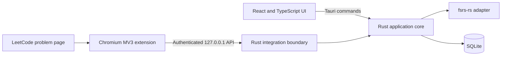

# Ankicode Desktop MVP Design

**Approved:** 2026-07-18  
**Status:** Accepted for MVP implementation

## Product boundary

Ankicode is a macOS-first, local-only desktop application for applying spaced
repetition to LeetCode problems. The desktop application uses Tauri 2 with a
React/TypeScript interface and an application-owned Rust core. SQLite is the
system of record.

The scheduler will wrap the BSD-licensed `fsrs-rs` crate behind an
Ankicode-owned interface. Ankicode may reuse Anki's scheduling concepts, but it
must not fork, copy, or incorporate Anki desktop's AGPL code.

Google authentication, cloud services, cloud synchronization, signing,
notarization, and cross-platform packaging are outside the MVP.

## System architecture

The Rust core is divided into five boundaries:

- `problems`: problem identity, metadata, and lifecycle.
- `learning`: append-only review history and rebuildable FSRS projections.
- `daily_queue`: deterministic, persisted daily assignments.
- `integration`: the loopback API and extension-facing contracts.
- `storage`: SQLite connections, migrations, and repositories.

These boundaries are scaffolds in the first task. Schema, scheduler, queue, and
integration behavior belong to later tasks.

## Learning model

A listed problem is one schedulable item. A review is completed only after the
user manually records one of `Again`, `Hard`, `Medium`, or `Easy`. Each rating
appends an immutable review event; derived schedule state is a projection that
can be rebuilt from those events. Event append and projection update will be
transactional.

## Daily assignment constraints

Each local day receives one fixed, deterministic assignment:

- Daily budget: **2**
- Easy problem cost: **1**
- Medium problem cost: **2**
- Hard problems remain stored but are not scheduled in the MVP.
- Overdue items are selected before new items.
- Ordering is deterministic by due time and then insertion time.
- Once persisted, an assignment does not change during that local day.
- There is no swapping and no refill when an assigned item is removed.

## Extension and local API

The companion is a Chromium Manifest V3 extension. It communicates only with
an authenticated API bound to `127.0.0.1`. Pairing will use a one-time code and
issue a scoped bearer token. The API will restrict extension origins, validate
payloads, and require idempotency keys for adds and submissions. The extension
must never read or persist LeetCode credentials or session cookies.

Pairing, metadata capture, submission observation, retry outbox behavior, and
the API itself are later implementation work. The MVP will retain manual URL
entry and manual rating as fallback paths.

## Planned verification

The completed MVP will include:

- Rust unit tests and temporary-SQLite integration tests for FSRS transitions,
  event replay, weighted caps, overdue ordering, fixed daily assignments,
  idempotency, and timezone boundaries.
- React component tests.
- Extension contract tests.
- A mocked Playwright journey covering add, assignment, accepted submission,
  rating, and rescheduling.

Release verification will run formatting, linting, type checks, Rust tests,
frontend and extension tests, end-to-end tests, and a Tauri production build.
The first deliverable is an unsigned internal macOS build. Signing,
notarization, Google login, cloud sync, and non-macOS packages remain later
phases.
